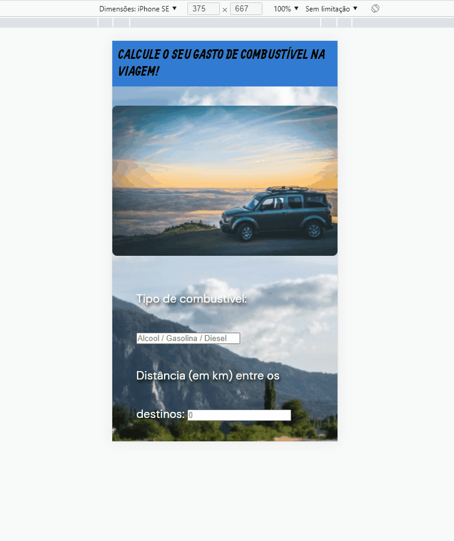

<h1 align="center">Calculadora de gastos com combustível na viagem</h1>
<h2 align="center">(en = Travel fuel expenses calculator)</h2>

<a href="https://fuelcalculator.netlify.app" target="_blank" rel="noopener noreferrer">https://fuelcalculator.netlify.app/</a>
  

    <li> Sobre (About)</li>
    <li>Tecnoligias (Tecnoligies)</li>
    <li>Pré-Requisitos (Features)</li>
    <li>Autor (Author)</li>
  

<h1>Sobre</h1>
  <h2>About</h2>
    
 Este projeto tem como finalidade criar uma calculadora simples para calcular os gastos com combustível durante uma viagem (somente ida e ida e volta), utilizando HTML, CSS e javascript

    
This project have as objective create a simple calculator, to estimate the costs with fuel during a trip, using HTML, CSS and javascript

<h1 align="center">
  
</h1>

 

<h1 align="center">
  
</h1>

<h1>Tecnologias</h1>
<h2>Technologies<h2>

- HTML 5

- CSS 3

- JavaScript

 

<h1>Pré-requisitos</h1>
  <h2>Prerequisites</h2>
  <li>Navegador atualizado na última versão (last version browser)</li>
  <li>Um bom editor de textos para visualizaçao do código (ex: VS Code) - (an good code editor such as VS Code)</li> 

<h1>Autor</h1>
  <h2>(Author)<h2>
  <h3>Douglas Antonio Muniz Borges</h3> 
  
Visite minhas redes: (Visit my media)

  <a href="https://github.com/douglasamb">Github
  
<a href="https://www.linkedin.com/in/douglas-borges-100661232" target="_blank">Linkedin

